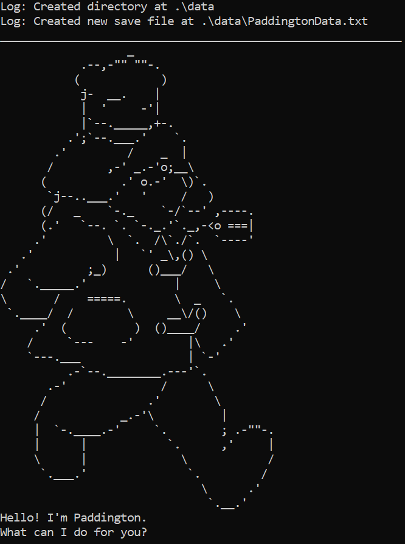
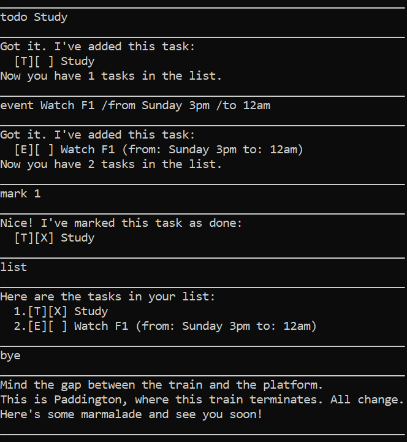

# Paddington User Guide




The Paddington chatbot is a desktop app for managing tasks, optimised for use via a Command Line Interface (CLI).
Manage your tasks easily. Add to-dos, deadlines and events, mark completed ones, and searching by keywords.
\
\
With the Paddington Bear, your tasks are kept safely and organised at Paddington Station in London.

---

## Quick Start

1. Ensure you have Java 17 or above installed in your Computer.\
   **Mac users**: Ensure you have the precise JDK version prescribed here. 
2. Download the latest .jar file from here.
3. Copy the file to the folder you want to use as the home folder for your AddressBook.
4. Open a terminal, cd into the folder with the jar file.
5. Run: `java -jar Paddington.jar` 
6. Type a command and press Enter to execute it.\
   You may refer to the Features below for details of each command.

## Features

### Adding a todo: `todo`
Adds a task with its description.

Format:
```
todo DESCRIPTION
```

Example:
```
todo Eat marmalade
```

Expected output:
```
Got it. I've added this task:
  [T][ ] Eat marmalade
```

### Adding a deadline: `deadline`
Adds a task with its description and deadline.

Format:
```
deadline DESCRIPTION /by DATE
```

Example:
```
deadline Head to Paddington Gift Shop /by 3pm
```

Expected output:
```
Got it. I've added this task:
  [D][ ] Head to Paddington Gift Shop (by: 3pm)
```

### Adding an event: `event`
Adds a task with its description, start and end times.

Format:
```
event DESCRIPTION /from START_TIME /to END_TIME
```

Example:
```
event Visit the Tower of London /from Saturday 2pm /to 5pm
```

Expected output:
```
Got it. I've added this task:
  [E][ ] Visit the Tower of London (from: Saturday 2pm to: 5pm)
```

### Listing all tasks: `list`
Shows all tasks saved.

Format:
```
list
```

Example:
```
list
```

Expected output:
```
Here are the tasks in your list:
  1.[T][ ] Eat marmalade
  2.[D][ ] Head to Paddington Gift Shop (by: 3pm)
  3.[E][ ] Visit the Tower of London (from: Saturday 2pm to: 5pm)
```

### Marking a task: `mark`
Marks a task as completed.

Format:
```
mark TASK_NUMBER
```

Example:
```
mark 1
```

Expected output:
```
Nice! I've marked this task as done:
  [T][X] Eat marmalade
```

### Unmarking a task: `unmark`
Marks a task as not complete.

Format:
```
unmark TASK_NUMBER
```

Example:
```
unmark 1
```

Expected output:
```
OK, I've marked this task as not done yet
  [T][ ] Eat marmalade
```

### Deleting a task: `delete`
Removes a task from the list.

Format:
```
delete TASK_NUMBER
```

Example:
```
delete 2
```

Expected output:
```
Noted. I've removed this task:
  [D][ ] Head to Paddington Gift Shop (by: 3pm)
```

### Finding a task: `find`
Lists all tasks that contains the keyword. The search is case-insensitive.

Format:
```
find KEYWORD
```

Example:
```
find marmalade
```

Expected output:
```
Here are the matching tasks in your list:
  1.[T][ ] Eat marmalade
```

### Quitting the chatbot: `bye`
Terminates the session. All tasks are saved.

Format:
```
bye
```

Example:
```
bye
```

Expected output:
```
Mind the gap between the train and the platform.
This is Paddington, where this train terminates. All change.
Here's some marmalade and see you soon!
```
